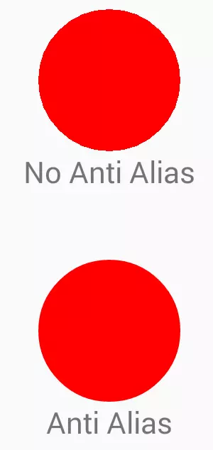

### canvas 

#### paint

##### **ANTI_ALIAS_FLAG 属性可以得到平滑的图形。**

```
Paint p = new Paint(Paint.ANTI_ALIAS_FLAG);
    //或者
Paint p = new Paint();
p.setAntiAlias(true);
```

正如你看到的，设置 ANTI_ALIAS_FLAG 属性可以产生平滑的边缘。**这里它能起作用是因为默认下每当 onDraw 被调用时系统先将 Canvas 清空然后重绘所有东西。**当我在下文详细讨论 ANTI_ALIAS_FLAG 的工作原理时， 你会意识到这段信息的重要性

##### **ANTI_ALIAS_FLAG 是怎么工作的**

ANTI_ALIAS_FLAG **通过混合前景色与背景色来产生平滑的边缘**。背景色是透明的而前景色是红色的，**ANTI_ALIAS_FLAG 通过将边缘处像素由纯色逐步转化为透明来让边缘看起来是平滑的**

**为什么设置了 ANTI_ALIAS_FLAG 后你们图形的边缘还是十分粗糙**

- 避免重绘。
- 在重绘前清空你的 Bitmap。

添加一行代码让它在每次**重绘前先清空 Bitmap**。当然，如果你觉得纯色更加符合你的需求的话，你也可以不用每次都清空 Bitmap

​	

```java
  @Override
    protected void onDraw(Canvas canvas) {
        super.onDraw(canvas);
        if (bitmap == null) {
            bitmap = Bitmap.createBitmap(200,
                                         200,
                                         Bitmap.Config.ARGB_8888);
            bitmapCanvas = new Canvas(bitmap);
        }
        bitmapCanvas.drawColor(
                  Color.TRANSPARENT,
                  PorterDuff.Mode.CLEAR); //this line moved outside if
        drawOnCanvas(bitmapCanvas);
        canvas.drawBitmap(bitmap, mLeftX, mTopY, p);
    }

    protected void drawOnCanvas(Canvas canvas) {
        canvas.drawCircle(mLeftX + 100, mTopY + 100, 100, p);
    }
```



##### setShadowLayer

```java
public void setShadowLayer(float radius, float dx, float dy, int color)
radius:模糊半径，radius越大越模糊，越小越清晰，但是如果radius设置为0，则阴影消失不见
dx:阴影的横向偏移距离，正值向右偏移，负值向左偏移
dy:阴影的纵向偏移距离，正值向下偏移，负值向上偏移
color: 绘制阴影的画笔颜色，即阴影的颜色（对图片阴影无效）

```

##### view的硬件加速

**硬件加速能够带来性能提升**，android为什么要弄出这么多级别的控制，而不是默认就是全部硬件加速呢？**原因是并非所有的2D绘图操作支持硬件加速**，如果您的程序中使用了**自定义视图或者绘图调用，程序可能会工作不正常**。如果您的程序中只是用了标准的视图和Drawable，放心大胆的开启硬件加速吧！具体是哪些绘图操作不支持硬件加速呢?以下是已知不支持硬件加速的绘图操作：

- Canvas
  - [clipPath()](http://developer.android.com/reference/android/graphics/Canvas.html#clipPath(android.graphics.Path))
  - [clipRegion()](http://developer.android.com/reference/android/graphics/Canvas.html#clipRegion(android.graphics.Region))
  - [drawPicture()](http://developer.android.com/reference/android/graphics/Canvas.html#drawPicture(android.graphics.Picture))
  - [drawPosText()](http://developer.android.com/reference/android/graphics/Canvas.html#drawPosText(char[], int, int, float[], android.graphics.Paint))
  - [drawTextOnPath()](http://developer.android.com/reference/android/graphics/Canvas.html#drawTextOnPath(char[], int, int, android.graphics.Path, float, float, android.graphics.Paint))
  - [drawVertices()](http://developer.android.com/reference/android/graphics/Canvas.html#drawVertices(android.graphics.Canvas.VertexMode, int, float[], int, float[], int, int[], int, short[], int, int, android.graphics.Paint))
- Paint
  - [setLinearText()](http://developer.android.com/reference/android/graphics/Paint.html#setLinearText(boolean))
  - [setMaskFilter()](http://developer.android.com/reference/android/graphics/Paint.html#setMaskFilter(android.graphics.MaskFilter))
  - [setRasterizer()](http://developer.android.com/reference/android/graphics/Paint.html#setRasterizer(android.graphics.Rasterizer))


另外还有一些绘图操作，开启和不开启硬件加速，效果不一样：

- Canvas
  - [clipRect()](http://developer.android.com/reference/android/graphics/Canvas.html#clipRect(android.graphics.Rect))： `XOR`, `Difference和ReverseDifference裁剪模式被忽略，3D变换将不会应用在裁剪的矩形上。`
  - [drawBitmapMesh()](http://developer.android.com/reference/android/graphics/Canvas.html#drawBitmapMesh(android.graphics.Bitmap, int, int, float[], int, int[], int, android.graphics.Paint))：colors数组被忽略
  - [drawLines()](http://developer.android.com/reference/android/graphics/Canvas.html#drawLines(float[], android.graphics.Paint))：反锯齿不支持
  - [setDrawFilter()](http://developer.android.com/reference/android/graphics/Canvas.html#setDrawFilter(android.graphics.DrawFilter))：可以设置，但无效果
  - 
- Paint
  - [setDither()](http://developer.android.com/reference/android/graphics/Paint.html#setDither(boolean))： 忽略
  - [setFilterBitmap()](http://developer.android.com/reference/android/graphics/Paint.html#setFilterBitmap(boolean))：过滤永远开启
  - [setShadowLayer()](http://developer.android.com/reference/android/graphics/Paint.html#setShadowLayer(float, float, float, int))：只能用在文本上
- ComposeShader
  - [ComposeShader](http://developer.android.com/reference/android/graphics/ComposeShader.html)只能包含不同类型的shader (比如一个[BitmapShader](http://developer.android.com/reference/android/graphics/BitmapShader.html)和一个[LinearGradient](http://developer.android.com/reference/android/graphics/LinearGradient.html)，但不能是两个[BitmapShader](http://developer.android.com/reference/android/graphics/BitmapShader.html)实例)
  - [ComposeShader](http://developer.android.com/reference/android/graphics/ComposeShader.html)不能包含ComposeShader

这里有一点需要非常注意的是**setShadowLayer只有文字绘制阴影支持硬件加速**，其它都不支持硬件加速，所以为了方便起见，我们需要在自定义控件中禁用硬件加速。

```java
//对单独的View在运行时阶段禁用硬件加速
if (Build.VERSION.SDK_INT >= Build.VERSION_CODES.HONEYCOMB) {
            setLayerType(LAYER_TYPE_SOFTWARE, null);
}
```

### Property Animator

​	View Animation 包括 **Tween Animation（补间动画）和 Frame Animation(逐帧动画)；**

​	Property Animator 包括 **ValueAnimator 和 ObjectAnimation；**

##### **view动画和属性动画不同点**

1.  **引入时间不同**

   ​	View Animation 是 API Level 1 就引入的。Property Animation 是 API Level 11 引入的，即 Android 3.0 才开始有 Property Animation 相关的 API

2. **所在包名不同**

    View Animation 在包 android.view.animation 中。而 Property Animation API 在包 android.animation 中

   1. **动画类的命名不同**

      View Animation 中动画类取名都叫 XXXXAnimation,而在 Property Animator 中动画类的取名则叫 XXXXAnimator

##### 为什么引入 Property Animator(属性动画)

  问题：如何利用补间动画来将一个控件的背景色在一分钟内从绿色变为红色？**这个效果想必没办法仅仅通过改变控件的渐入渐出、移动、旋转和缩放来实现吧**，而这个效果是可以通过 Property Animator 完美实现的 ？

**不同点一：Property Animator 能实现补间动画无法实现的功能**

**不同点二**：**View Animation 仅能对指定的控件做动画，而 Property Animator 是通过改变控件某一属性值来做动画的**

​	假设我们将一个按钮从左上角利用补间动画将其移动到右下角，**在移动过程中和移动后，这个按钮都是不会响应点击事件的**。这是为什么呢**？因为补间动画仅仅转变的是控件的显示位置而已，并没有改变控件本身的值**

​	View Animation 的动画实现是通过其 Parent View 实现的，在 View 被 drawn 时 Parents View 改变它的绘制参数，**这样虽然 View 的大小或旋转角度等改变了，但 View 的实际属性没变**，所以有效区域还是应用动画之前的区域

**不同点三：补间动画虽能对控件做动画，但并没有改变控件内部的属性值。而 Property Animator 则是恰恰相反，Property Animator 是通过改变控件内部的属性值来达到动画效果的**

##### ValueAnimator使用

1. **创建 ValueAnimator 实例**

   ```java
   ValueAnimator animator = ValueAnimator.ofInt(0,400);  
   animator.setDuration(1000);  
   animator.start(); 
   ```

   这里我们利用 ValueAnimator.ofInt 创建了一个值从 0 到 400 的动画，动画时长是 1s，然后让动画开始。从这段代码中可以看出，**ValueAnimator 没有跟任何的控件相关联，那也正好说明 ValueAnimator 只是对值做动画运算，而不是针对控件的，我们需要监听 ValueAnimator 的动画过程来自己对控件做操作**。

2. **添加监听** 上面的三行代码，我们已经实现了动画，下面我们就添加监听

   ```java
   ValueAnimator animator = ValueAnimator.ofInt(0,400);  
   animator.setDuration(1000);  
   
   animator.addUpdateListener(new ValueAnimator.AnimatorUpdateListener() {  
       @Override  
       public void onAnimationUpdate(ValueAnimator animation) {  
           int curValue = (int)animation.getAnimatedValue();  
           Log.d("test","curValue:"+curValue);  
       }  
   });  
   animator.start(); 
   ```

   - ValueAnimator 只负责对指定的数字区间进行动画运算
   - 我们需要对运算过程进行监听，然后自己对控件做动画操作

    

   ```java
   private void doAnimation(){  
       ValueAnimator animator = ValueAnimator.ofInt(0,400);  
       animator.setDuration(1000);  
   
       animator.addUpdateListener(new ValueAnimator.AnimatorUpdateListener() {  
           @Override  
           public void onAnimationUpdate(ValueAnimator animation) {  
               int curValue = (int)animation.getAnimatedValue();  
               tv.layout(curValue,curValue,curValue+tv.getWidth(),curValue+tv.getHeight());  
           }  
       });  
       animator.start();  
   }  
   ```

   在监听过程中，通过 layout 函数来改变 textview 的位置。这里注意了，**我们是通过 layout 函数来改变位置的，我们知道 layout 函数在改变控件位置时是永久性的，**即通过更改控件 left,top,right,bottom 这四个点的坐标来改更改坐标位置的，而不仅仅是从视觉上画在哪个位置，所以通过 layout 函数更改位置后，控件在新位置是可以响应点击事件的

##### 常用方法

1. **ofInt 与 ofFloat**

   ```java
   public static ValueAnimator ofInt(int... values)  
   public static ValueAnimator ofFloat(float... values) 
   ```

   他们的参数类型都是可变参数长参数，所以我们可以传入任何数量的值；传进去的值列表，就表示动画时的变化范围**；比如 ofInt(2,90,45)就表示从数值 2 变化到数字 90 再变化到数字 45**；所以我们传进去的数字越多，动画变化就越复杂。从参数类型也可以看出 ofInt 与 ofFloat 的唯一区别就是传入的数字类型不一样，ofInt 需要传入 Int 类型的参数，而 ofFloat 则表示需要传入 Float 类型的参数。 

 2,**常用函数**

```java
/** 
 * 设置动画时长，单位是毫秒 
 */  
ValueAnimator setDuration(long duration)  
/** 
 * 获取 ValueAnimator 在运动时，当前运动点的值 
 */  
Object getAnimatedValue();  
/** 
 * 开始动画 
 */  
void start()  
/** 
 * 设置循环次数,设置为 INFINITE 表示无限循环 
 */  
void setRepeatCount(int value)  
/** 
 * 设置循环模式 
 * value 取值有 RESTART，REVERSE， 
 */  
void setRepeatMode(int value)  
/** 
 * 取消动画 
 */  
void cancel() 
```

**setRepeatCount()、setRepeatMode()、cancel（）**

 setRepeatCount(int value)**用于设置动画循环次数,设置为 0 表示不循环**，设置为 **ValueAnimation.INFINITE** 表示无限循环。 cancel()用于取消动画 我们着重说一下 setRepeatMode：

```java
/** 
 * 设置循环模式 
 * value 取值有 RESTART，REVERSE 
 */  
void setRepeatMode(int value) 
```

setRepeatMode(int value)**用于设置循环模式**，**取值为 ValueAnimation.RESTART 时,表示正序重新开始，当取值为 ValueAnimation.REVERSE 表示倒序重新开始**


##### 两个监听器：

```java
/** 
 * 监听器一：监听动画变化时的实时值 
 */  
public static interface AnimatorUpdateListener {  
    void onAnimationUpdate(ValueAnimator animation);  
}  
//添加方法为：public void addUpdateListener(AnimatorUpdateListener listener)  
/** 
 * 监听器二：监听动画变化时四个状态 
 */  
public static interface AnimatorListener {  
    void onAnimationStart(Animator animation);  
    void onAnimationEnd(Animator animation);  
    void onAnimationCancel(Animator animation);  
    void onAnimationRepeat(Animator animation);  
}  
//添加方法为：public void addListener(AnimatorListener listener)  
```

##### **取消监听**

```java
/** 
 * 移除 AnimatorUpdateListener 
 */  
void removeUpdateListener(AnimatorUpdateListener listener);  
void removeAllUpdateListeners();  
 /** 
  * 移除 AnimatorListener 
  */  
void removeListener(AnimatorListener listener);  
void removeAllListeners();
```

##### 其他函数

```java
/** 
 * 延时多久时间开始，单位是毫秒 
 */  
public void setStartDelay(long startDelay)  
/** 
 * 完全克隆一个 ValueAnimator 实例，包括它所有的设置以及所有对监听器代码的处理 
 */  
public ValueAnimator clone() 
```

setStartDelay(long startDelay)非常容易理解，**就是设置多久后动画才开始**。 但 clone()这个函数就有点难度了；首先是什么叫克隆。就是完全一样！注意是完全一样！就是复制出来一个完全一样的新的 ValueAnimator 实例出来。对原来的那个 ValueAnimator 是怎么处理的，在这个新的实例中也是全部一样的。 我们来看一个例子来看一下，什么叫全部一样.

## View的工作原理——View的工作流程

View的工作流程主要是指measure、layout、draw这三大流程，即测量、布局和绘制**，其中measure确定View的测量宽高，layout确定View的最终宽高和四个顶点的位置，而draw则将View绘制到屏幕上**

#### measure过程

measure过程要分情况来看

- 如果只是一个原始的View，那么通过measure方法就完成了其测量过程

- 如果是一个ViewGroup，出了完成自己的测量过程外，**还会遍历去调用所有的子元素的measure方法，各个子元素再递归去执行这个流程，下面针对这两种情况分别讨论**。

  1.  **View的measure过程**

     View的measure过程由其measure方法来完成，**measure方法是一个final类型的方法**，这意味着子类不能重写此方法，在View的onMeasure方法，**因此只需要看onMeasure的实现即可，**View的onMeasure方法如下所示

     ```java
         protected void onMeasure(int widthMeasureSpec, int heightMeasureSpec) {
             setMeasuredDimension(getDefaultSize(getSuggestedMinimumWidth(), widthMeasureSpec),
                     getDefaultSize(getSuggestedMinimumHeight(), heightMeasureSpec));
         }
     ```

     上述代码很简洁，但是简洁并不代表简单，**setMeasuredDimension方法会设置View宽高的测量值**，因此我们只需要看getDefaultSize这个方法即可：

     ​      

     ```java
         public static int getDefaultSize(int size, int measureSpec) {
             int result = size;
             int specMode = MeasureSpec.getMode(measureSpec);
             //specSize就是View测量后的大小
             int specSize = MeasureSpec.getSize(measureSpec);
      
             switch (specMode) {
             case MeasureSpec.UNSPECIFIED:
                 result = size;
                 break;
             case MeasureSpec.AT_MOST:
             case MeasureSpec.EXACTLY:
                 result = specSize;
                 break;
             }
             return result;
         }
     ```


##### 说一下SpaceMode得三种模式：

**UNSPECIFIED:**
     
	父容器不对View有任何限制，要多大给多大，这种情况一般用于系统内部，表示一种测量得状态。

**EXACTLY:**
     
	父容器已经检测出View所需要得精确大小，这个时候View得最终大小就是SpaceSize所指定得值。

**它对应LayoutParams中的match_parent和具体的数值这两种模式**。
     
**AT_MOST:**
     
	**父容器指定了一个可用大小即 SpaceSize,View 的大小不能大于这个值**，具体什么值要看不同View的具体实现，**它对应LayoutParams中的wrap_conent.**


可以看出，getDefaultSize这个方法的逻辑很简单，**对于我们来说，我们只需要看AT_MOST和EXACTLY这两种情况**。简单地理解，其实**getDefaultSize返回的大小就是measureSpec中的specSize，而这个specSize就是View测量后的大小**，这里多次提到测量后的大小，**是因为View最终的大小是在layout阶段确定，所以这里必须要加以区分**，**但是几乎所有情况下View的测量大小和最终大小是相等的**。
     
   至于UNSPECIFIED这种情况，一般用于系统内部的测量过程，在这种情况下，View的大小为getDefaultSize的第一个参数size，即宽高分别为getSuggestedMinimumWidth和getSuggestedMinimumHeight这两个方法的返回值，看一下它们的源码：

```java
 protected int getSuggestedMinimumHeight() {
          return (mBackground == null) ? mMinHeight : max(mMinHeight, mBackground.getMinimumHeight());
   
      }
   
      protected int getSuggestedMinimumWidth() {
          return (mBackground == null) ? mMinWidth : max(mMinWidth, mBackground.getMinimumWidth());
      }
```

这里只分析getSuggestedMinimumWidth方法的实现，getSuggestedMinimumHeight和它实现原理是一样的。getSuggestedMinimumWidth的代码可以看出，

**如果View没有设置背景，那么View的宽度为mMinWidth，而mMinWidth对应于android:minWidth这个属性所指的值，因此View的宽度即为android:minWidth属性所指定的值。这个属性如果不指定，那么mMinWidth则默认为0；**

**如果View指定了背景，则View的宽度为max(mMinWidth,mBackground.getMinimumWidth())。mMinWidth的含义我们已经知道了，那么mBackground.getMinimumWidth()是什么呢？我们看一下Drawable的getMinimunWidth方法，如下所示**。

  ```java
  public int getMinimumWidth() {
      final int intrinsicWidth = getIntrinsicWidth();
      return intrinsicWidth > 0 ? intrinsicWidth : 0;
  }
  ```

  可以看出，**getMinimumWidth()返回的就是Drawable的原始宽度**，前提是这个Drawable有原始宽度，否则就返回0。那么Drawable在什么情况下有原始宽度呢？这里先举个例子说明一下，**ShapeDrawable无原始宽高，而BitmapDrawable有原始宽高(图片的尺寸)**，详细内容会在后续章节进行介绍。


这里再总结一下**getSuggestedMinimumWidth的逻辑：如果View没有设置背景，那么返回android:minWidth这个属性所指定的值，这个值可以为0；如果View设置了背景，则返回android:minWidth和背景的最小宽度这两种中的最大值**，getSuggestedMinimumWidth和getSuggestedMinimumHeight的返回值就是View再UNSPECIFIED情况下的测量宽高。

**从getDefaultSize方法的实现来看，View的宽高由specSize决定**，所以我们可以得出如下结论：直接继承View的自定义控件需要重写onMeasure方法并设置wrap_content时的自身大小，否则再布局中使用wrap_content就相当于使用match_parent。为什么呢？这个原因需要结合上述代码和上表才能更好地理解。从上述代码中我们知道，如果View在布局中使用wrap_content，那么它的specMode是AT_MOST模式，在这种模式下，它的宽高等于specSize；查看上表可以知道，这种情况下View的specSize是parentSize，而parentSize是父容器中目前可以使用的带线啊哦，也就是父容器当前剩余的控件大小。很显然，View的宽高就等于父容器当前剩余的控件大小，这种效果和在布局中使用match_parent完全一致。如何解决这个问题呢？也很简单，如下所示。


#####    Drawable之getIntrinsicWidth()和getIntrinsicHeight()

​	 https://stackoverflow.com/questions/6536418/why-are-the-width-height-of-the-drawable-in-imageview-wrong

`image.getDrawable().getIntrinsicWidth()`我得到的值大于源图像的宽度。X坐标返回2880而不是1920，那是1.5倍太大吗？


您说可绘制对象来自您的`/res`文件夹。它在哪个文件夹中？

- `/res/drawable`

- `/res/drawable-mdpi`

- `/res/drawable-hdpi`

  等等..

您要测试的设备的密度是多少？它是一般密度为240dpi的Nexus S吗？因为如果您的源可绘制对象位于`drawable-mdpi`文件夹中，并且您正在使用240dpi的设备进行测试，那么Android系统将自动将可绘制对象放大一个因子，`1.5`以便物理尺寸与160dpi的基线设备密度保持一致。

调用时`getIntrinsicWidth()`，返回的是Android缩放可绘制对象后可绘制对象**想要**的大小。您会注意到`2880 = 1920 * 1.5`

如果您将可绘制对象放置在`/res/drawable`Android系统中，则将这些可绘制对象视为适用于mdpi设备的可绘制对象，因此会在Nexus S中进行放大。如果这是针对hdpi屏幕的，并且您不希望将其可扩展使用，请尝试将其放置在`drawable-hdpi`


 2, 

  1. 


#### onMeasure


