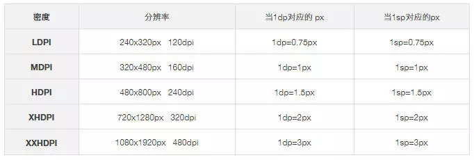

#### 

#### **obtainStyledAttributes**

```java
context.obtainStyledAttributes( AttributeSet set, @StyleableRes int[] attrs)
例如：
	TypedArray  typedArray = context.obtainStyledAttributes(attrs, R.styleable.SwitchButton);

```

​		该方法是Context类为我们提供的获取style中特定属性值的方法。通过这个方法，我们就可以获取在style中定义的各种属性值，然后根据获取到的不同的属性值实现差异化的效果。 

**简单封装**

```
  private static boolean optBoolean(TypedArray typedArray,
                                      int index,
                                      boolean def) {
        if(typedArray == null){return def;}
        return typedArray.getBoolean(index, def);
    }
    
     private static int optColor(TypedArray typedArray,
                         int index,
                         int def) {
        if(typedArray == null){return def;}
        return typedArray.getColor(index, def);
    }
    
       private static int optPixelSize(TypedArray typedArray,
                             int index,
                             int def) {
        if(typedArray == null){return def;}
        return typedArray.getDimensionPixelOffset(index, def);
    }
    
```

####  三个方法 区别

- **getDimension 返回float   **

- **getDimensionPixelOffset 强转为int**

- **getDimensionPixelSize 是四舍五入**


**dp2px**

```
 private static int dp2pxInt(float dp){
        return (int) dp2px(dp);
 }
 
 
 private static float dp2px(float dp){
 Resources r = Resources.getSystem();
 return TypedValue.applyDimension(TypedValue.COMPLEX_UNIT_DIP, dp, 							r.getDisplayMetrics());
 }
 
 
 public static float applyDimension(int unit, float value,
                                       DisplayMetrics metrics)
    {
        switch (unit) {
        case COMPLEX_UNIT_PX:
            return value;
        case COMPLEX_UNIT_DIP:
            return value * metrics.density;
        case COMPLEX_UNIT_SP:
            return value * metrics.scaledDensity;
        case COMPLEX_UNIT_PT:
            return value * metrics.xdpi * (1.0f/72);
        case COMPLEX_UNIT_IN:
            return value * metrics.xdpi;
        case COMPLEX_UNIT_MM:
            return value * metrics.xdpi * (1.0f/25.4f);
        }
        return 0;
    }	
```

####  **applyDimension**

这个方法的作用是 **把Android系统中的非标准度量尺寸转变为标准度量尺寸** (Android系统中的标准尺寸是px, 即像素) 

 **标准单位: px** (px是安卓系统内部使用的单位, dp是与设备无关的尺寸单位 ) 

 **非标准单位: dp, in, mm, pt, sp** 

```java
 TypedValue.applyDimension()方法的功能就是把非标准尺寸转换成标准尺寸, 如:  

dp->px:  TypedValue.applyDimension(TypedValue.COMPLEX_UNIT_DIP, 20, context.getResources().getDisplayMetrics());

in->px: TypedValue.applyDimension(TypedValue.COMPLEX_UNIT_IN, 20, context.getResources().getDisplayMetrics());

mm->px: TypedValue.applyDimension(TypedValue.COMPLEX_UNIT_MM, 20, context.getResources().getDisplayMetrics());

pt->px: TypedValue.applyDimension(TypedValue.COMPLEX_UNIT_PT, 20, context.getResources().getDisplayMetrics());

sp->px: TypedValue.applyDimension(TypedValue.COMPLEX_UNIT_SP, 20, context.getResources().getDisplayMetrics());
```

####  density和scaledDensity的区别

- density：The logical density of the display.显示密度density = dpi/160 

-  scaledDensity：A scaling factor for fonts displayed on the display.显示字体的缩放因子 = density

  

   

#### dpi 、 dip 、分辨率、屏幕尺寸、px、density 关系以及换算

 **dip ：** device independent pixels ，设备无关像素   **dp就是dip** 

  **px ：** 像素不多说 

 **dpi ：** 直接来说就是一英寸(2.54厘米)多少个点。常见取值 120，160，240。我一般称作像素密度，简称密度 

 **density ：** 直接翻译的话貌似叫 密度。常见取值 1.5 ， 1.0 。 

 **分辨率：** 横纵2个方向的像素点的数量，常见取值 480X800 ，320X480 

**屏幕尺寸：** 屏幕对角线的长度。电脑电视同理。

   这里还涉及另外一个问题，就是屏幕比例的问题。因为只确定了对角线长，2边长度还不一定。所以有了4：3、16：9这种，这样就可以算出屏幕边长了。

重点来了，网上很多帖子直接把 density 叫做“密度”，然后就说他是像素密度，然后就说他是dpi。

在android里面，获取一个窗口的metrics，里面有这么几个值

- **metrics.density;**

- **metrics.densityDpi;**

**densityDpi就是我们常说的dpi**。**density其实是  DPI / (160像素/英寸)  后得到的值**。是不是有点奇怪，因为我带了单位。。。这个涉及到后面一个比较重要的东西，后面再说。

 从上面就看得出了，**DPI本身的单位也是 像素/英寸，所以density其实是没单位的，他就是一个比例值** 

**而dpi的单位是 像素/英寸**，比较符合物理上面的密度定义，密度不都是单位度量的值么，所以我更喜欢把dpi叫像素密度，简称密度，density还是就叫density。

#### 来算算dpi

比如一个机器，屏幕4存，分辨率480X800，他的dpi能算么。

因为不知道边长，肯定不能分开算，4是对角线长度，那直接用勾股定理算对角线像素，除以4，算出来大概是 dpi = 233 像素/英寸。

那么density就是  （233 px/inch）/（160 px/inch）=1.46 左右


 顺带说下，**android默认的只有3个dpi，low、medium和high**，对应 120、160、240，如果没有特别设置，所有的dpi都会被算成这3个，具体可以参考下这个帖子 

 其中的default就是160。 

然后就该算了，我们写布局的时候，肯定还是要知道1个dp到底有多少px的。

换算公式如下：   **dp = （DPI/（160像素/英寸））px  =  density px**

​    ***\*注意，这里都是带单位的。px是单位，dp是单位，density没单位。\****

为了方便，假设dpi是240 像素/英寸 ， 那么density就是1.5

那么就是  dp=1.5px ，注意这是带了单位的，也就是 设备无关像素 = density 像素

那么转换为数值计算的话，应该是下面这个式子

**PX = density * DP**

也就是 

**像素值 = density * 设备无关像素值**  ，请注意这里有个值字。


所以，90px 就应该是 60 dp 。不要问我为什么和公式不符了，全是单位的问题，物理老师死得早啊 


####  屏幕适配 

-  **常见的屏幕** 

  -  	Hdipi:480*800

    ​    Ldpi:240*320

    ​    Xhdpi:1280*720

    ​    Mdpi:320*480

-  **屏幕的基本概念** 
  -  **分辨率**:长和宽总的像素点的总和。（有多少个点） 
  -  **屏幕的大小**:买手机会问买多大的手机,英寸，手机的对角线 
  -   **Dip**: 翻译成中文,密度。有质量就有密度。屏幕适配和分辨率没有任何关系的。屏幕的密度和适配息息相关。每一个英寸所展示的像素点 

**屏幕尺寸**

- 是指显示器屏幕对角线的尺寸，一般用英寸来表示。

- 可测量显示器对角线长度转换为英寸即可！1英寸=2.54厘米 

   新建任何项目的时候，**values 下的dimens 必须把大的数字写在前面**eq:layout-1280x720 中间不是*，而是小写的x.） 

#### sp与dip

- 正常情况下，都可以使用sp.  （如果你的控件是具体的数值，或者是填充父窗体） 
-  **sp: scaled pixels(放大像素)**. 主要用于字体显示best for textsize。 
-  由此，根据 google 的建议，TextView 的字号最好使用 sp 做单位 
-  假设你是包裹内容的话，就不能使用sp ，就必须使用dip. 

#### 为什么我们要用sp表示Android中的字体大小?

`dp`具有恒定比过渡到`px`：`dp = px * ratio`。`ratio`永远不会改变任何特定的设备。

虽然`sp`（比例缩放）具有可扩展比例：`sp = px * ratio * scale`。`ratio`永远不会改变，但`scale`用户配置。这`scale`可以被需要更大字号的人使用，例如，更舒适地使用设备。


####  每个drawable 下都有相同文件名的图片。那么手机会加载那个图片呢？ 

  图片适配（**首先会往上面去找，如果整个上面都没有的话**，就会往下面去找图片dimens,layout,图片，进行适配。

  总有一些手机适配不了。通过多套布局进行适配（注意细节：**如果是进行多套layout 布局适配的话，必须把大的数字写在前面**eq:layout-1280x720 中间不是* ，而是小写的x.）  

  **通过代码进行屏幕适配**。Adapter5 apps 得到屏幕宽高，给一个比例。0.5 是保证精度。误差不可比避免，减少误差。 

####  屏幕的密度 

​	 **ldpi** Resources for low-density(ldpi) screens (~120dpi).  每个英寸多少个点 

​	 **mdpi**   Resources formedium-density (mdpi) screens (~160dpi). (This is the baseline density.)  

​	**hdpi**   Resources for high-density(hdpi) screens (~240dpi). 

​	**xhdpi**   Resources for extrahigh-density (xhdpi) screens (~320dpi). 

 **屏幕的密度和icon 的大小：开发一套图片，只放到drawable 中，就会根据比例进行缩放。为什么用一套图就能进行适配** 

####  缩放因子 

​		 3:4:6:8  0.75:1:1.5:2 

​		 icon的大小  通过比例进行缩放。根据比例算出来的。 

​		 36x36 for low-density 

​		 48x48 for medium-density 

​		 72x72 for high-density 

​		 96x96 for extra high-density 

根据缩放比例计算宽高。

Hdipi:480*800

Ldpi:240*320

 Xhdpi:1280*720

 Mdpi:320*480

     Ⅰ，现在是1280*720 那么宽的一半应该是多少dp?
    
           720/2=360;360/2=180; 他是xhdpi.

  Ⅱ：现在是480*800，宽度的一半多少dp？

       480/2=240; 240/1.5=160;
#### 主流的设计稿 1080*1920

 安卓尺寸众多，按每个屏幕去适配肯定是不现实的。 

 所以为了解决这个问题，安卓手机屏幕有自己初始的固定密度，安卓会根据这些屏幕不同的密度自己进行适配。这一点内容掌握到能满足自己设计工作需要就可以了 

 目前市场上，只有Android系统的手机才有1080P全高清的产品。1080P是说手机屏幕的分辨率达到1920*1080像素。1080P的屏幕最直观的改变当然是屏幕精细度的巨大提升 


 **DP：**  **安卓专用长度单位。**

- **以160 DPI屏幕为标注，则1DP=1PX** 

   计算公式：dp x dpi/160=px 

   例：以720x1280px （320dpi）为例

   计算 1dp x 320 dpi/=2px 

 **SP：安卓专用字体单位。**

- **以160 DPI屏幕为标注，则1SP=1PX** 

    计算公式：sp x dpi/160=px 

   例：以720x1280px （320dpi）为例计算 1sp x 320 dpi/=2px 

#### **设计稿尺寸** 

-  根据目前市场主流设备尺寸来看，我们要用1080 x 1920 PX 来做安卓设计稿尺寸。 	

​	

 **安卓机型各种尺寸下的PX与DP、SP的对应关系** 



 **距离单位DP与PX的对应关系** 


